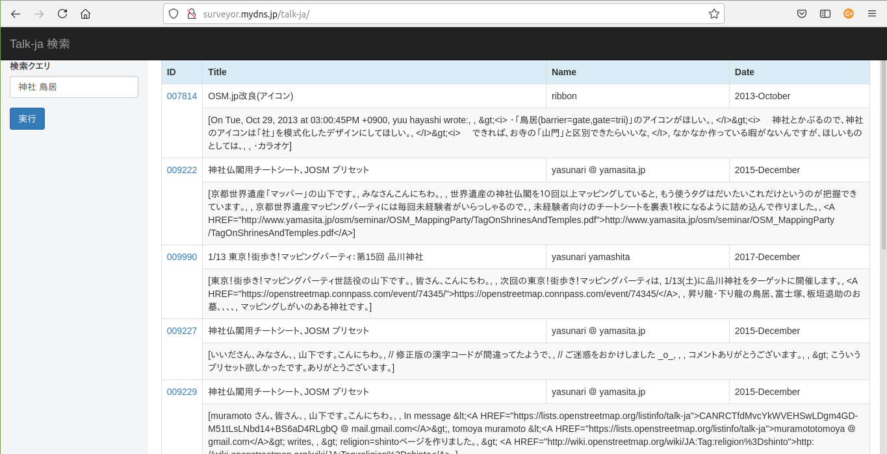

README

"[メーリングリスト(Talk-ja)](https://lists.openstreetmap.org/listinfo/talk-ja)"の"[全文検索サービス](http://surveyor.mydns.jp/solr/#/talkja)"の"[検索クエリークライアント](http://surveyor.mydns.jp/talk-ja)"です。



# Settings

| name 							| default 	| comment 			|
| ----------------------------- | ---------	| ------------------|
| server.servlet.context-path	| /talk-ja	| コンテキスト名		|
| server.port					| 8080		| port number		|
| app.solrurl					| http://surveyor.mydns.jp/solr/talkja	| と言い併せ先検索エンジンへのURL |

# INSTALL

"Raspberry pi 3 B+"へのインストール

`http://raspi3:8210/talk-ja`

```
/home/pi/
　└─ talk-ja/
　　　├─ talk-ja.war
　　　└─ start.sh
```

`$ vi start.sh`

```
java -jar /home/pi/talk-ja/talk-ja.war \
 --server.port=8210 \
 --app.solrurl=http://raspi3:8983/solr/talkja
```

### 自動起動：

`$ sudo vi /etc/systemd/system/talk-ja.service`

```
	[Unit]
	Description=talk-ja
	After=syslog.target
	
	[Service]
	Type=simple
	WorkingDirectory=/home/pi/talk-ja
	ExecStart=/usr/lib/jvm/java-8-openjdk-armhf/bin/java -jar /home/pi/talk-ja/talk-ja.war --server.port=8210 --app.solrurl=http://raspi3:8983/solr/talkja
	
	TimeoutStopSec=5
	StandardOutput=null
	
	[Install]
	WantedBy = multi-user.target
```

```
$ sudo systemctl daemon-reload
$ sudo systemctl start talk-ja
$ sudo systemctl stop talk-ja
$ sudo systemctl enable talk-ja
```
